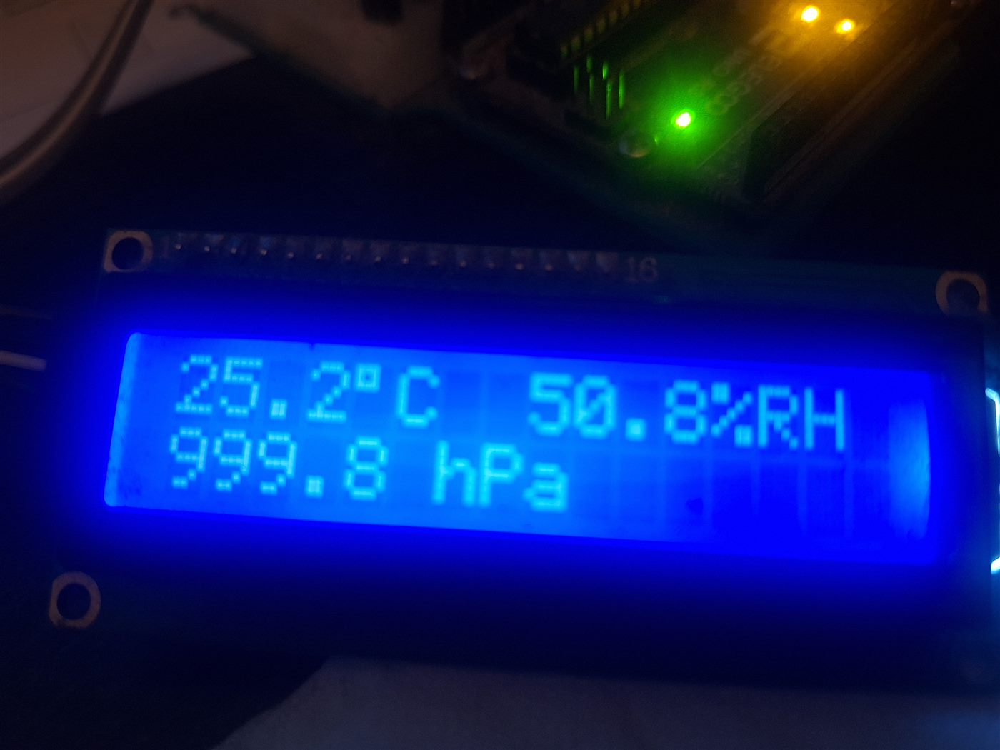

# Weather Station — Uno + BME280 + LCD

Temperature, humidity and sea-level–corrected pressure on a 16×2 character LCD, read from a
Bosch BME280 by an Arduino Uno. Everything is on one I²C bus — four wires.





---

## What it does

- Reads the BME280 every 2 s (`REFRESH_MS`).
- Shows two lines on the LCD:

  ```
  25.2°C  50.8%RH
  1014.1 hPa
  ```

  Row 2 is the **station pressure reduced to sea level** for your altitude, so it matches the
  QNH your local airport / weather service quotes.
- Mirrors full-precision values to the serial port at 9600 baud, including the raw station
  pressure:

  ```
  23.88 C  50.47 %RH  station 999.81 hPa  MSL 1014.06 hPa
  ```

- If the sensor doesn't answer at power-up, the LCD shows `SENSOR ERROR` / `BME280 0x76 fail`
  and the sketch stops rather than printing garbage.

## Bill of materials

| Qty | Part | Notes |
|----:|------|-------|
| 1 | Arduino Uno (or compatible ATmega328P board) | 5 V logic |
| 1 | BME280 breakout, I²C | The purple "GY-BME280" style has an onboard 3.3 V regulator and level shifting and is 5 V-safe. A bare Bosch/Adafruit breakout is **3.3 V only** — see [Power](#a-note-on-the-bme280-supply). |
| 1 | 16×2 HD44780 character LCD | |
| 1 | PCF8574 I²C "backpack" for the LCD — **GY-IICLCD type** | Piggybacks on the LCD. See [Why this LCD needs a special library](#why-this-lcd-needs-a-special-library). |
| 4 | Female–female jumper wires | +5 V, GND, SDA, SCL |
| 1 | USB cable for the Uno | Powers the build and carries the serial output |

**I²C addresses** (confirmed with a bus scan during development):

| Device | Address | Why |
|--------|---------|-----|
| PCF8574 LCD backpack | `0x20` | A0/A1/A2 address pads open (base address). A `PCF8574**A**` part would be `0x38`. |
| BME280 | `0x76` | SDO pin tied to GND. Tie it high, or use a board strapped the other way, and it becomes `0x77` — change `BME_ADDR` in the sketch. |

## Wiring

Four nets leave the Uno and run to **both** modules in parallel. Nothing else on the Arduino
is used.

| Net | Suggested wire | Arduino Uno | LCD backpack (`0x20`) | BME280 (`0x76`) |
|-----|----------------|-------------|-----------------------|-----------------|
| Power | red | `5V` | `VCC` | `VCC` |
| Ground | black | `GND` | `GND` | `GND` |
| I²C data | amber | `A4` / `SDA` | `SDA` | `SDA` |
| I²C clock | green | `A5` / `SCL` | `SCL` | `SCL` |

Pin **order** on the modules varies between manufacturers — always match by the silkscreen
label, not by position. On the diagram, a solid dot is a join; wires that merely cross with no
dot are not connected.

### Why this LCD needs a special library

A PCF8574 backpack is just an 8-bit I²C port expander wired to the LCD's control and data
lines. **Which** expander bit goes to which LCD pin is not standardised, and the "GY-IICLCD"
board is wired differently from the mass-market backpack that `LiquidCrystal_I2C` /
`LiquidCrystal_PCF8574` assume:

| PCF8574 bit | Mass-market backpack | **GY-IICLCD backpack (this project)** |
|:-----------:|----------------------|--------------------------------------|
| P0 | RS | data D4 |
| P1 | RW | data D5 |
| P2 | E  | data D6 |
| P3 | backlight | data D7 |
| P4 | data D4 | **E** |
| P5 | data D5 | **RW** |
| P6 | data D6 | **RS** |
| P7 | data D7 | **backlight** (active-low) |

Drive a GY backpack with the standard mapping and the HD44780 never receives a valid
initialisation — you get a row of faint blocks / speckle on line 1 and nothing on line 2. This
project uses **`LiquidCrystal_I2C_GY`**, which has the GY mapping built in. It is bundled in
[`libraries/`](libraries/).

## Libraries

Nothing here is in the Arduino Library Manager. `Wire` ships with the AVR core; the two
device libraries are **bundled in this repository** under [`libraries/`](libraries/):

| Library | Purpose | Upstream | License |
|---------|---------|----------|---------|
| `LiquidCrystal_I2C_GY` | LCD over the GY PCF8574 backpack | <https://github.com/t3chguy/LiquidCrystal_I2C_GY> | MIT |
| `cactus_io_BME280_I2C` | BME280 temperature / humidity / pressure | cactus.io ("cactus.io BME280 library") | none stated — see [`libraries/README.md`](libraries/README.md) |

Install them **either** by copying both folders into your sketchbook `libraries/` directory
(`~/Arduino/libraries/` on macOS/Linux, `%USERPROFILE%\Documents\Arduino\libraries\` on
Windows), **or** by pointing the compiler straight at the bundled copies — see below.

## Build & upload

### Arduino IDE

1. Copy `libraries/LiquidCrystal_I2C_GY` and `libraries/cactus_io_BME280_I2C` into your
   sketchbook `libraries/` folder, then restart the IDE.
2. Open `WeatherLCD/WeatherLCD.ino`.
3. **Tools → Board → Arduino Uno**, and select the serial port.
4. Upload.

Arduino IDE 2.x bundles the `arduino-cli` binary used below; a standalone build is at
<https://arduino.github.io/arduino-cli/>.

### arduino-cli (keeps the bundled libraries out of your sketchbook)

```sh
arduino-cli core install arduino:avr

# compile, using the libraries shipped in this repo
arduino-cli compile --fqbn arduino:avr:uno --libraries ./libraries ./WeatherLCD

# find the board, then flash it
arduino-cli board list
arduino-cli upload --fqbn arduino:avr:uno -p <PORT> ./WeatherLCD
```

`<PORT>` is like `COM4` (Windows) or `/dev/ttyACM0` (Linux) / `/dev/cu.usbmodemXXXX` (macOS).

A clean build reports roughly **40 % of flash and 28 % of RAM** on the Uno.

## Configuration

Two knobs at the top of `WeatherLCD/WeatherLCD.ino`:

```c
#define TEMP_CAL_C   -1.4     // °C added to every reading; negative cancels self-heating
#define ALTITUDE_M    123.0   // your altitude above sea level, in metres
```

- **`TEMP_CAL_C`** — the BME280 usually reads a little high when it sits near a warm regulator.
  Compare against a reference thermometer and set the offset; `-1.4` was right for this build.
- **`ALTITUDE_M`** — needed for the sea-level pressure reduction. Roughly **+12 hPa per 100 m**.
  Find yours with the [Open-Meteo elevation API](https://open-meteo.com/en/docs/elevation-api),
  an Ordnance Survey / topographic map, or (UK) a postcode lookup such as checkmypostcode.uk.
  The value in the repo (123 m) is for the original build's location.

Other constants in the same file: `REFRESH_MS`, `LCD_ADDR` (`0x20`), `BME_ADDR` (`0x76`),
`LCD_COLS` / `LCD_ROWS`.

## Expected output

**LCD**

```
Row 0:  25.2°C  50.8%RH
Row 1:  1014.1 hPa
```

The degree symbol is HD44780 character code `0xDF`; on a few LCD ROM variants that glyph
differs — if so, define a custom character.

**Serial monitor (9600 baud)**

```
23.88 C  50.47 %RH  station 999.81 hPa  MSL 1014.06 hPa
```

## Troubleshooting

| Symptom | Likely cause / fix |
|---------|--------------------|
| Row of blocks or faint speckle on line 1, line 2 blank | Wrong LCD library (needs the GY pin map — use `LiquidCrystal_I2C_GY`), **or** the contrast trimpot on the backpack. Sweep the pot through its whole range; the readable window is narrow. |
| LCD shows `SENSOR ERROR` / `BME280 0x76 fail` | BME280 not answering: check SDA/SCL/VCC/GND, and try `#define BME_ADDR 0x77`. |
| Text is garbled (not blocks) | Contrast, or a non-GY backpack with a different data-bit order. |
| Backlight dark, no text | Power or ground not reaching the backpack. |
| Nothing on the serial monitor | Set it to 9600 baud. |
| Not sure what's on the bus | Flash any I²C-scanner sketch first and confirm `0x20` and `0x76` both respond. |

## How it works

**LCD.** The HD44780 is driven in 4-bit mode. Each byte is sent as two nibbles, shifted out
through the PCF8574's 8 pins along with the RS / E strobes; `LiquidCrystal_I2C_GY` knows the GY
board routes those to P6 / P4 (and the backlight to P7, active-low).

**Sensor.** `cactus_io_BME280_I2C` reads the BME280's factory calibration coefficients in
`begin()` and applies Bosch's compensation formulas on every `readSensor()`, returning
compensated °C, %RH and pascals. `getPressure_MB()` gives hectopascals (≡ millibars).

**Sea-level pressure.** The station reading is reduced with the standard hypsometric form:

```
p0 = p · ( 1 − 0.0065·h / (T + 0.0065·h + 273.15) ) ^ −5.257
```

where `p` is station pressure, `h` is `ALTITUDE_M`, and `T` is the current temperature in °C.

## License

Apache License 2.0 — see [`LICENSE`](LICENSE) and [`NOTICE`](NOTICE).

The bundled libraries in [`libraries/`](libraries/) are third-party and carry their own terms
(see the table above and [`libraries/README.md`](libraries/README.md)).

## Credits

- BME280 driver — [cactus.io](https://cactus.io)
- GY LCD backpack driver — Michael Telatynski ([t3chguy](https://github.com/t3chguy/LiquidCrystal_I2C_GY))
- Project — [Zuvuyan](https://github.com/Zuvuyan)
